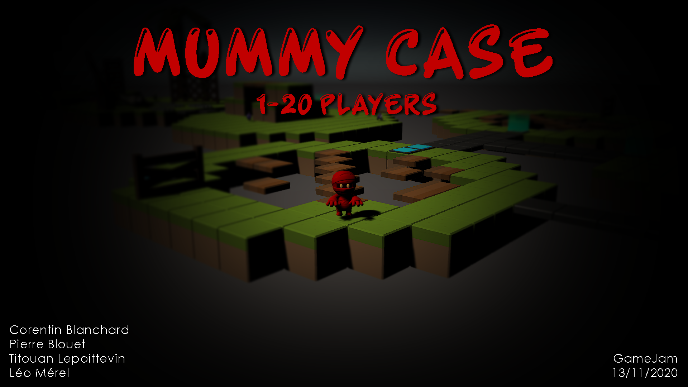
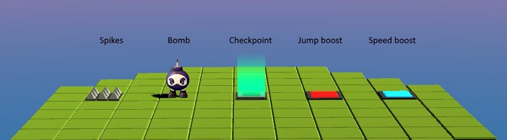
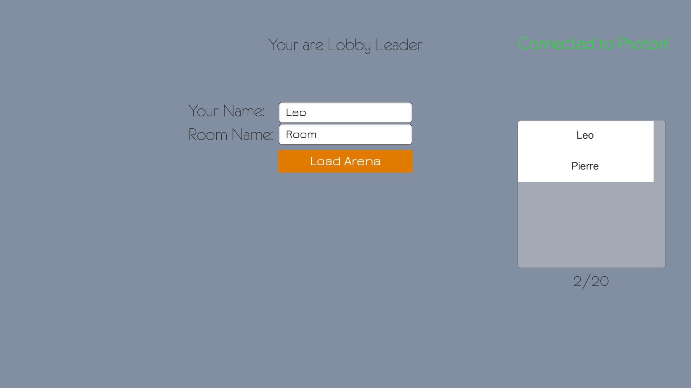

# MummyCase

MummyCase is a multiplayer (up to 20 players !) platform racing game. We developped it in 48h, during a local GameJam organized in our school.   

The goal is simple : be the first player to cross the finish line. To do so, you'll need to avoid obstacles and make the smartest moves. Some bonuses are here to help you.   

Here is a glimpse of the obstacles and bonuses :

   

To play with your friends, one will have to create a room : enter his name, enter a room name and click "join room".   
Once the room is created, other players can join the room by entering the same room name and clicking the "join room" button.   
When everyone has joined, the room leader can launch the game by pressing "Load arena".   

 

